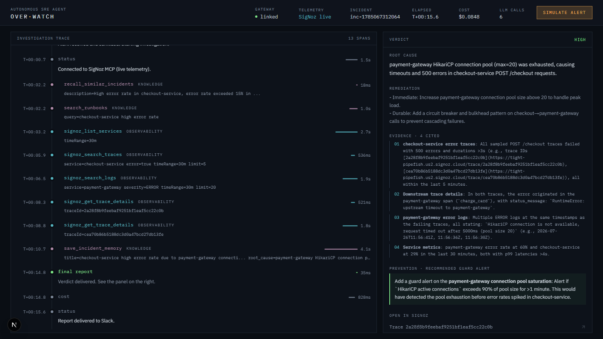

# 🛡️ Project Over-Watch

**An autonomous SRE agent that investigates production incidents on SigNoz —
and gets provably better at it, every single time.**

Built for [**Agents of SigNoz**](https://www.wemakedevs.org/hackathons/signoz)
(WeMakeDevs × SigNoz) — **Track 01: AI & Agent Observability**.

[Architecture Deep-Dive](ARCHITECTURE.md) · [Live SigNoz Setup](SETUP-LIVE.md) · [Agent Internals](agent-python/README.md)



*A real run against live SigNoz Cloud telemetry — not a mock. Every evidence item links back to the actual trace.*

---

## Why Over-Watch?

When a production alert fires, an on-call engineer spends the first ~45
minutes doing the same thing every time: pull up the dashboard, find the
failing service, chase the trace downstream, grep the logs, check if anyone
deployed recently — and only then start actually fixing anything. That
investigation is repetitive, evidence is scattered across traces/logs/metrics,
and half of it has been solved before by someone else on the team who isn't
awake right now.

Over-Watch automates that investigation. It's an autonomous agent — modeled on
[OpenSRE](https://github.com/Tracer-Cloud/opensre)'s direct tool-calling loop
philosophy — that reasons over real SigNoz telemetry the same way a senior SRE
would: form hypotheses, follow the evidence, cite exact traces and log lines,
and never guess. Two things make it more than "a chatbot in front of your
dashboards":

- **It's proven, not just demoed.** A quantified benchmark (below) runs the
  agent against injected incidents with known root causes and deliberate red
  herrings, scored by an LLM judge against a closed vocabulary — the same
  category of evaluation OpenSRE itself uses, not vibes.
- **It learns.** Every resolved incident is written back to memory, so the next
  occurrence of the same failure is recognised instantly instead of
  re-investigated from scratch — and each report recommends the specific guard
  alert that would have caught this incident earlier.

---

## How It Works

```
SigNoz alert fires
     │
     ▼
Node.js Gateway ──▶ RabbitMQ ──▶ Python Agent (direct tool-calling loop)
                                       │
                         ┌─────────────┼─────────────┐
                    Observability                Knowledge & Memory
                 (SigNoz MCP, real          (runbooks, past incidents)
                  traces/logs/metrics)
                                       │
                         ┌─────────────┴─────────────┐
                    Evidence-backed RCA        Incident saved to memory
                    (Root Cause · Confidence   (recognised instantly
                     · Evidence · Remediation    next time)
                     · Prevention)
                                       │
                                       ▼
              Redis pub/sub ──▶ Next.js live dashboard  +  Slack / Telegram
```

1. **Sanitize** — PII (emails, IPs, phone numbers, SSNs) is masked out of the
   alert before it ever reaches an LLM.
2. **Investigate** — a single reasoning loop (no LangGraph, no fixed DAG — see
   [ARCHITECTURE.md §0](ARCHITECTURE.md#0-design-philosophy--why-this-architecture))
   checks memory and runbooks first, forms hypotheses, then tests them against
   **real SigNoz telemetry** via the official SigNoz MCP server: list services
   → find the failing/slow trace → follow it downstream → confirm with logs
   and metrics.
3. **Report** — a structured Markdown RCA (Root Cause, Confidence, Evidence,
   Remediation, Prevention), every claim traceable to a tool call the agent
   actually made, with clickable deep-links back into the SigNoz UI.
4. **Close the loop** — the agent saves the resolution to memory so the next
   occurrence is instant, and recommends the specific guard alert (name +
   condition) that would have caught this failure earlier.
5. **Deliver** — every step (`thinking`, `tool_call`, `final_report`, `cost`)
   is streamed to a live dashboard, and the finished report is posted to
   Slack or Telegram so nobody has to go looking for it.

---

## 📊 Benchmark

Unlike a demo that "looks like it works," Over-Watch ships a quantified proof:
**5 injected incidents**, each a distinct failure class with a deliberately
planted red herring, scored by an LLM judge against a **closed vocabulary** of
root causes (so a vague or hedged answer can't pass) and a per-scenario
rubric — the same category of evaluation OpenSRE's own benchmark suite uses.

**Measured result** (`gpt-4.1`, 3 trials, judge-scored, reproducible with one
command):

| Metric | Result |
|---|---|
| RCA accuracy | **100%** (5/5) — mean **100% ± 0pp** across 3 trials |
| Red-herring resistance | **100%** — never fooled by a planted distractor, any trial |
| Rubric score | **100%** — every judge-graded scoring point satisfied |
| Cost per incident | **~$0.04** |
| LLM calls per incident | **~6** |

Zero variance across trials is the point — this isn't a lucky single run.
Reproduce it yourself:

```bash
cd agent-python
uv sync
uv run overwatch eval --trials 3
```

No SigNoz, no Docker, no RabbitMQ required — each scenario ships its own
telemetry fixtures; only an LLM key is needed. Full methodology, scenario list,
and the honest caveat on the one sub-100% metric: [ARCHITECTURE.md §5](ARCHITECTURE.md#5-the-proof-layer-agent-pythoneval).

Prefer to just look? The 5 incident fixtures (full injected telemetry, red
herrings, and judge rubric) live in
[`agent-python/eval/scenarios.py`](agent-python/eval/scenarios.py), and the
actual output of the last real run — per-scenario judge reasoning, cost,
evidence recall — is committed at
[`agent-python/eval/last_scorecard.json`](agent-python/eval/last_scorecard.json).

---

## Capabilities

- **Direct tool-calling investigation loop** — no graph/chain framework;
  the LLM freely picks from 9 tools across Observability and Knowledge.
- **Real SigNoz MCP integration** — genuine `stdio` protocol handshake against
  the official SigNoz MCP server, correct tool names/params (not guessed),
  with a labeled `MOCK`-fallback for demo resilience if SigNoz is unreachable.
- **Runbook-aware** — searches human-authored playbooks before investigating
  from scratch.
- **Incident memory** — recalls similar past incidents; every resolution is
  saved for next time.
- **Prevention guidance** — every report names the specific guard alert
  (signal + threshold) that would have caught the incident earlier.
- **Report delivery** — the finished RCA is posted to Slack or Telegram, with
  clickable SigNoz links, so the on-call engineer never leaves their channel.
- **Evidence-backed, hallucination-resistant** — every claim must cite a real
  tool result; mocked evidence is explicitly labeled, never silently trusted.
- **PII masking** — alert payloads are sanitized before touching an external
  LLM.
- **Per-investigation cost tracking** — token usage and USD cost streamed live.
- **SigNoz deep-links** — every cited trace/service becomes a clickable link
  back into the SigNoz UI.
- **Quantified benchmark** — reproducible RCA accuracy, red-herring
  resistance, and cost, with variance across trials (not a single anecdote).
- **Live streaming dashboard + Slack delivery** — full transparency into the
  agent's reasoning as it happens, plus a one-click reliable demo trigger.

---

## Architecture

A four-layer system — full breakdown in [**ARCHITECTURE.md**](ARCHITECTURE.md):

1. **Command Center** (`frontend-mission-control/`) — Next.js + Tailwind.
   Live reasoning stream, evidence chain, Prevention card,
   SigNoz deep-links, one-click demo trigger.
2. **Gateway** (`gateway-node/`) — Node.js, Express, Socket.io, RabbitMQ,
   Redis. Catches SigNoz webhooks, queues durably, bridges Redis pub/sub to
   WebSocket clients, delivers to Slack.
3. **Brain** (`agent-python/`) — Python. The OpenSRE-style direct
   tool-calling loop, plus the `overwatch` CLI. Consumes from RabbitMQ,
   sanitizes PII, investigates via real SigNoz MCP + local Knowledge/Memory,
   saves the resolution to memory and delivers the report onward.
4. **Proof Layer** (`agent-python/eval/`) — the benchmark. Runs independently
   of the other three layers — no infra needed, just an LLM key.

---

## Quick Start

### 1. Infrastructure (RabbitMQ & Redis)
```bash
docker-compose up -d
```

### 2. Gateway (Node.js) — :4000
```bash
cd gateway-node
npm install
npm run start
```

### 3. Brain (Python)
```bash
cd agent-python
docker pull signoz/signoz-mcp-server:latest   # the agent spawns this over stdio
cp .env.example .env                          # set OPENAI_API_KEY, SIGNOZ_URL, SIGNOZ_API_KEY
uv sync
uv run overwatch doctor --deep                # preflight: verify the whole setup
uv run overwatch worker                       # listens on RabbitMQ incidents_queue
```

Everything runs through one command — `uv run overwatch` for an interactive
menu, or `overwatch doctor | eval | demo | worker | guide` directly.
If SigNoz/MCP is unreachable it falls back to labeled `MOCK` data so a demo
never hard-crashes. For real telemetry end-to-end, see
[**SETUP-LIVE.md**](SETUP-LIVE.md). Agent internals: [agent-python/README.md](agent-python/README.md).

### 4. Demo app (generates real telemetry to investigate)
```bash
cd agent-python
uv sync --group demo
python demo/sample_app.py     # exports traces + logs to SigNoz as it runs
```

### 5. Command Center (Next.js) — :3000
```bash
cd frontend-mission-control
npm install
npm run dev
```

### 6. Run the benchmark (no infra needed)
```bash
cd agent-python
uv run overwatch eval --trials 3
```

---

## Demo Script

1. Open **http://localhost:3000**.
2. Click **Simulate Alert**.
3. Watch the Gateway catch it, queue it to RabbitMQ.
4. Watch the agent pick it up, sanitize it, check memory/runbooks, and query
   SigNoz live — streamed step-by-step in the reasoning console.
5. The final RCA renders: Root Cause, Confidence, Evidence (with clickable
   SigNoz deep-links), Remediation — and a distinct **🛡️ Prevention** card
   recommending the specific guard alert (signal + threshold) that would have
   caught this incident earlier.
6. (Optional) The same report lands in Slack.
7. Cut to the benchmark scorecard — `uv run overwatch eval --trials 3` —
   for the proof this isn't a one-off.

---

## Security

Alert payloads are regex-sanitized (emails, IPs, phone numbers, SSNs) before
ever reaching an external LLM. Every piece of evidence the agent cites is
either a real, attributable SigNoz tool result or explicitly labeled
`"_source": "MOCK"` — mocked data is never silently presented as production
truth, in the report or in the benchmark.

---

## Judging Criteria Alignment

| Criterion | How Over-Watch addresses it |
|---|---|
| **Potential Impact** | Automates the first ~45 minutes of incident investigation; incident memory compounds that value — a repeat failure is recognised instead of re-investigated. |
| **Creativity & Innovation** | Not a read-only chatbot: it consults runbooks and past incidents, recommends the guard alert that would have caught the failure earlier, and delivers to Slack/Telegram. The quantified benchmark is itself a differentiator most entries in this track won't have. |
| **Technical Excellence** | Real MCP protocol with correct tool names, a documented Docker-networking fix, retry/backoff resilience, model-family-aware API calls, ASCII-safe cross-platform CLI, and a variance-checked benchmark. |
| **Best Use of SigNoz** | Every observability call goes through the genuine SigNoz MCP server over stdio — real tool names and parameters, verified against a live SigNoz Cloud instance with traces, logs and metrics from a two-service demo. |
| **User Experience** | One `overwatch` command with an interactive menu and a `doctor` that explains exactly what's broken; real-time reasoning stream, evidence with clickable SigNoz deep-links, Prevention card, Slack delivery. |
| **Presentation Quality** | This README, [ARCHITECTURE.md](ARCHITECTURE.md), and [SETUP-LIVE.md](SETUP-LIVE.md) mean every claim here is independently reproducible, not just asserted. |

---

## Documentation

- [**ARCHITECTURE.md**](ARCHITECTURE.md) — full component-by-component system design, design decisions, and the benchmark methodology.
- [**SETUP-LIVE.md**](SETUP-LIVE.md) — stand up self-hosted SigNoz, generate real telemetry, and run against live data end-to-end.
- [**casting.yaml**](casting.yaml) / [**casting.yaml.lock**](casting.yaml.lock) — the Foundry deployment spec and resolved lock file used to self-host SigNoz during development, included for reproducibility.
- [**agent-python/README.md**](agent-python/README.md) — the agent brain: loop, tools, SigNoz MCP client, knowledge layer, and benchmark CLI reference.

## License

MIT — see [LICENSE](LICENSE).
